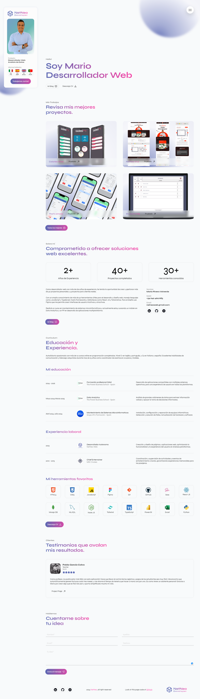

# 💼 My Personal Portfolio

## Overview

Welcome to my personal portfolio! This website showcases my skills as a
programmer and designer, highlighting my main projects, education, and
experience. It includes sections for tools I use daily, testimonials, and a
contact form to send emails directly to me. The site also features a colorful
and gradient-rich design with smooth JavaScript animations, and is fully
responsive.

## Features

- **Skills & Experience**: Detailed sections about my programming and design
  skills.
- **Projects**: Showcases my main projects with modal windows for detailed
  views.
- **Education & Experience**: Information about my academic background and work
  experience.
- **Tools**: Lists the tools and technologies I use regularly.
- **Testimonials**: Displays feedback from clients and colleagues.
- **Contact Form**: Allows users to send emails to me with their contact
  details.
- **Downloadable Resume**: Provides a link to download my resume.
- **Blog Section**: Shares my experiences and learning process in a blog format.
- **Smooth Animations**: Features JavaScript animations for a smooth user
  experience.
- **Responsive Design**: Ensures optimal viewing on all devices.
- **Easy Data Management**: Component data is mapped from separate files for
  easy updates.

## Live Demo

Check out the live version of the portfolio
[HERE!](https://netneodev.netlify.app/).

## Screenshots

   

